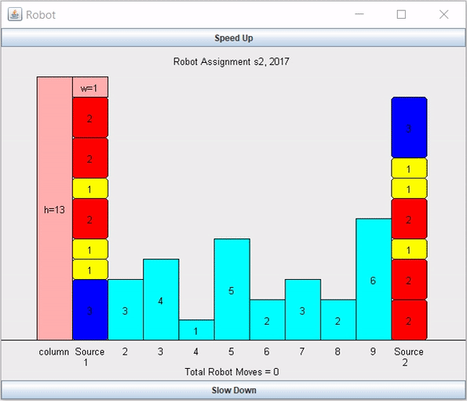

# COSC1073 AT1 | Robot Simulation Part A
**Course Name:** Programming 1

A Java project that moves a robot arm around, picks blocks from two source columns and places the picked block onto a bar (from left to right, then loops back from right to left).

This assignment focuses on building the behaviour of the robot using the skills and modern coding conventions learnt during the course; specifically, to utilise loops and selection/conditionals, arrays and methods to write an algorithm and avoid code repetition.

**Note:** This project was adapted from a template which was provided to students by the school faculty as to make it easier for them to mark assignment submissions.
